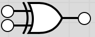

# COMP1600 Course Notes

This file contains my course notes for the course __Comp1600: Foundations of Computing__ and will be updated thoughout the semester.

- [COMP1600 Course Notes](#comp1600-course-notes)
  - [1. Boolean Logic](#1-boolean-logic)
    - [1.1. Boolean Algebra](#11-boolean-algebra)
    - [1.2. Boolean Functions and Operators](#12-boolean-functions-and-operators)
    - [1.3. Logic Gates](#13-logic-gates)
    - [1.4. Logical Equivalence](#14-logical-equivalence)
    - [1.5. Expressively Complete Sets](#15-expressively-complete-sets)
    - [1.6. Proving Boolean Expressions](#16-proving-boolean-expressions)
      - [Valid Boolean Equations](#valid-boolean-equations)
  - [2. Natural Deduction](#2-natural-deduction)
  - [3. First Order Logic](#3-first-order-logic)
  - [4. Structural Induction](#4-structural-induction)
  - [5. Hoare Logic](#5-hoare-logic)

## 1. Boolean Logic

### 1.1. Boolean Algebra

A Boolean expression is usually called a __predicate__ or a __statement__.

- __predicates__ are always true or false.

### 1.2. Boolean Functions and Operators

A __function__ takes inputs and returns outputs  
A __boolean function__ takes boolean inputs and returns boolean outputs.  These boolean functions can be represented using truth tables.  
__E.g.__  
$
  f(x,y): \mathbb{B}^2 \rightarrow \mathbb{B}
$
 x | y | $f(x,y)$  
---|---|---  
|T |T  |F
|T |F  |T
|F |T  |T
|F |F  |F  

__Boolean operators__  
We have three primary boolean operators which are used to write boolean expressions:

- AND ($\land$)  

 x | y | x $\land$ y  
---|---|---  
|T |T  |F
|T |F  |T
|F |T  |T
|F |F  |F

- OR ($\lor$)

 x | y | x $\lor$ y  
---|---|---  
|T |T  |F
|T |F  |T
|F |T  |T
|F |F  |F

- NOT ($\lnot$)

 x | $\lnot$ x
---|---
|T |F
|F |T

- IMPLIES ($\rightarrow$)

 x | y | x $\rightarrow$ y  
---|---|---  
|T |T  |T
|T |F  |F
|F |T  |T
|F |F  |T

- XOR ($\oplus$)

 x | y | x $\oplus$ y  
---|---|---  
|T |T  |F
|T |F  |T
|F |T  |T
|F |F  |F

These can be combined to create complex boolean expressions, which can then be represented by truth tables

### 1.3. Logic Gates

Most of the previously mentioned boolean operators can be represented using logic gates which are often used to represent circuits. These can also be represented using truth tables.

- AND

- OR

- NOT

- XOR

These can be combined into much larger circuits which can also be expressed as boolean expressions.  
__E.g.__  

$$Q = (x \land (y \land \lnot z)) \lor (x \land y) $$

### 1.4. Logical Equivalence

### 1.5. Expressively Complete Sets

A set of logical connectives is __expressively complete__ if it allows us to build all boolean functions. For example, the set {$\land$, $\lnot$} is expressively complete.

### 1.6. Proving Boolean Expressions

#### Valid Boolean Equations

__Associativity__  
$a \lor (b \lor c) = (a \lor b) \lor c$  
$a \land (b \land c) = (a \land b) \land c$  

__Commutativity__  
$a \lor b = b \lor a$  
$a \land b = b \land a$  

__Absorption__  
$a \lor (a \land b) = a$  
$a \land (a \lor b) = a$  

__Identity__  
$a \lor F = a$  
$a \land T = a$  

__Distributivity__  
$a \lor (b \land c) = (a \lor b) \land (a \lor c)$  

## 2. Natural Deduction

## 3. First Order Logic

## 4. Structural Induction

## 5. Hoare Logic
